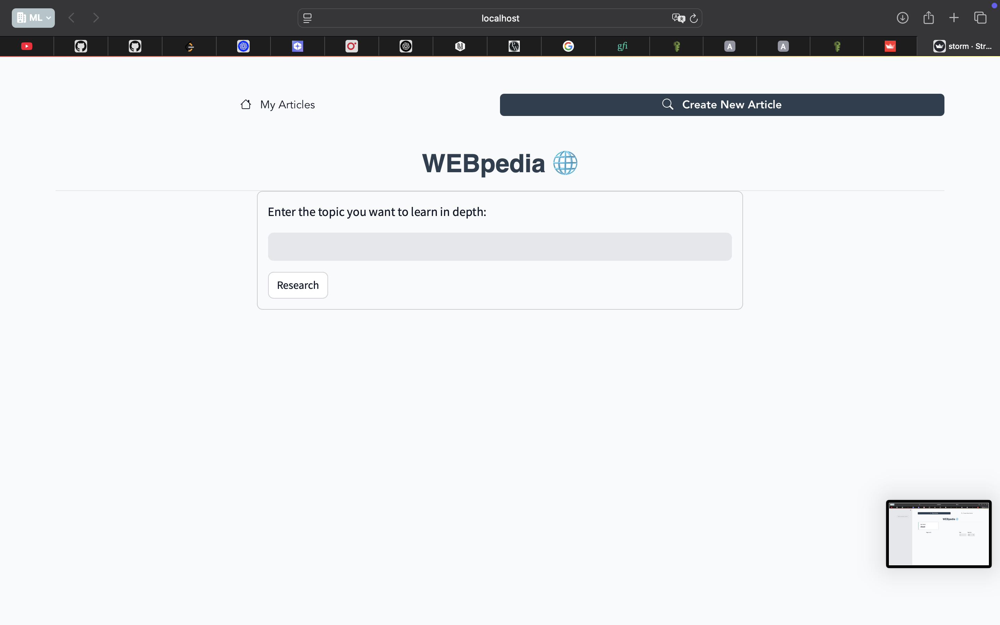
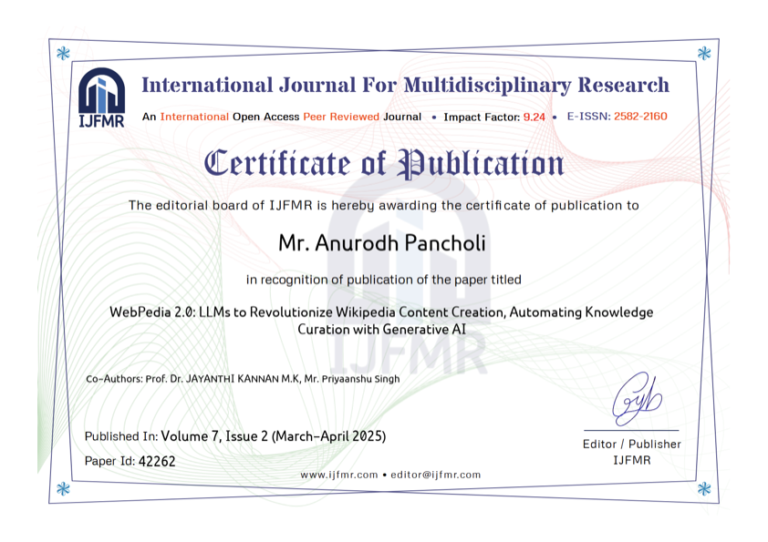

# WEBpedia: Minimal User Interface
##[Link](https://webpedia.streamlit.app)
**WEBpedia** is a minimal web interface built for intelligent article generation using `STORMWIKIRunner`. It provides a streamlined experience for users to create, view, and manage AI-generated articles.

## ✨ Features

- 📝 Create new articles using a user-friendly form interface.
- ⚙️ Track the step-by-step reasoning and generation process in real time.
- 📄 View the final article alongside its references in a side-by-side layout.
- 📚 Browse previously created articles from the "My Articles" page.

  

  

---

## 📜 Certificate

